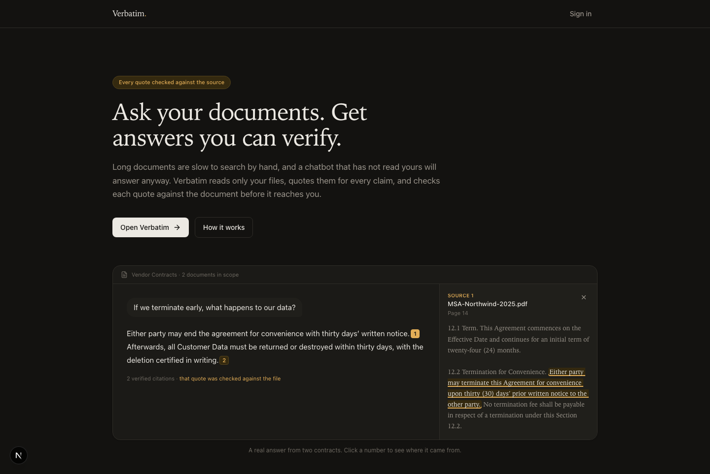
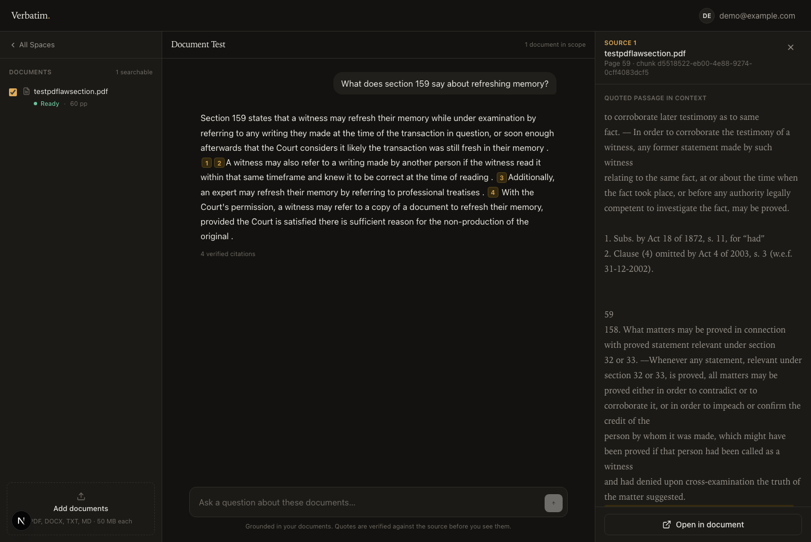
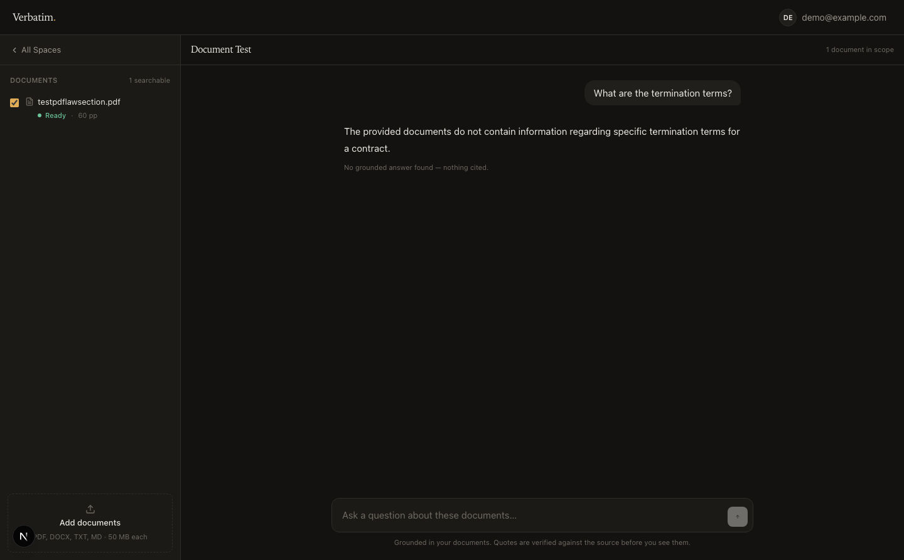
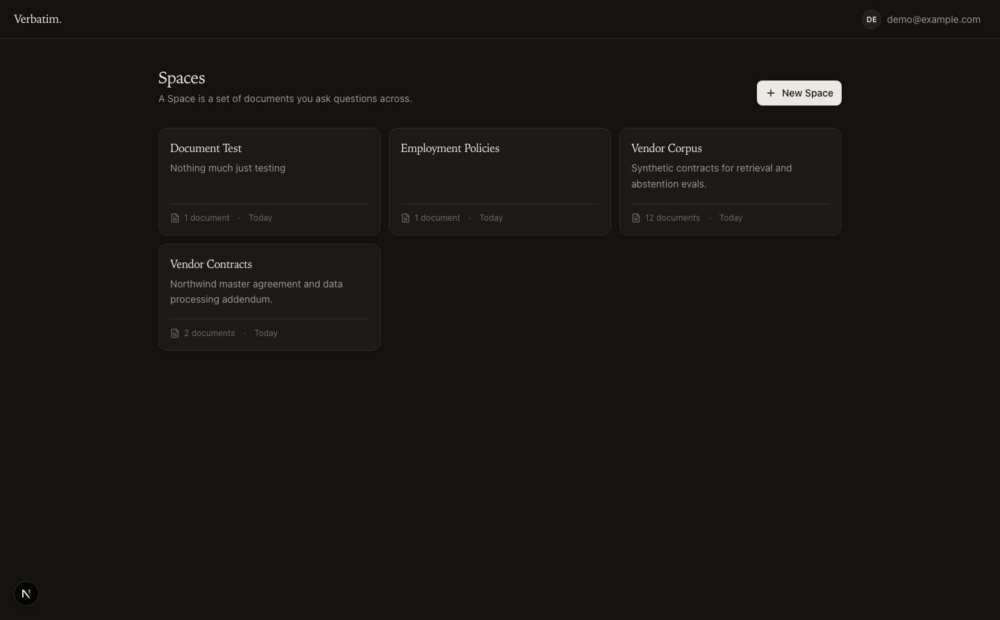

<div align="center">

# Verbatim

**Ask your documents. Get answers you can verify.**

Upload a contract, a policy or a 400-page statute. Ask in plain language. Every answer
quotes its source — and every quote is checked against the document before you see it.

</div>



---

## Purpose

Long documents are slow to search by hand. `Ctrl+F` finds strings, not answers — it fails
the moment your words differ from the author's. You know the contract says *something* about
ending it early, but the contract says "termination for convenience", so you scroll.

The obvious fix is to ask an AI. But a general chatbot has never read your document and will
answer anyway, fluently and often wrongly. For a contract, a policy or a medical protocol, a
confident wrong answer is worse than no answer.

The real gap is not intelligence. It is **verifiability**. Reading an AI answer about your own
document, you have no cheap way to check it — so you either re-read the source, losing the
time the tool promised to save, or you trust it blind.

## Goal

Make checking an answer take one click.

1. Answer only from the documents the user uploaded — never from the model's general knowledge
2. Attach a real quote to every factual claim, resolving to a page in the source file
3. Say **"I couldn't find this in your documents"** when that is the truth
4. Be fast enough to beat scrolling

Point 3 matters as much as the rest. A system that answers everything confidently scores well
on demos and cannot be trusted with anything that counts.

## Solution

Verbatim uses **retrieval-augmented generation** (RAG) with one extra step most
implementations skip.

The usual recipe: split documents into passages, store them as vectors, find the passages
closest to the question, and let the model answer from those. That reduces invented answers,
because the model is reading your text rather than recalling something similar.

It does not eliminate them. A model handed the right passage can still assert something
slightly beside it, and it will still cite the passage while doing so.

So Verbatim adds a **verification gate**. The model must supply a quote for every claim. The
server then locates that quote inside the passage it cites, and:

- a quote that is not really there is **dropped**
- what the user sees is the **document's own characters**, sliced out of the source — so a
  model that types a straight apostrophe still shows the document's curly one
- if a passage is about a different party or agreement than the question asked about, that
  is not an answer either

Groundedness stops being a hope about the model and becomes a property of the system.

---

## See it working

| A real answer, with its source open | An honest "not in your documents" |
|---|---|
|  |  |

Both are the Indian Evidence Act, 1872 — 60 pages, 91 indexed passages. On the left, a real
question answered with four verified citations. On the right, a question the document does
not cover, declined rather than guessed at.



---

## How it works

```
 Upload  ──▶  Parse & chunk  ──▶  Embed  ──▶  Postgres + pgvector
                                                      │
 Question ──▶  the agent searches ────────────────────┘
                     │  (it rephrases and searches again when results are thin)
                     ▼
              Answer with quotes  ──▶  Verification gate  ──▶  Cited answer
                                       drops what isn't there
```

**1 · Upload.** PDF, Word, text or Markdown. Each file is split into overlapping passages,
and every passage remembers the page it came from — which is what makes a citation possible
later.

**2 · Indexed two ways.** Every passage is embedded for *meaning* and indexed for *exact
wording*, then the two rankings are fused. Meaning alone misses `INV-90210`; wording alone
misses every paraphrase. You need both.

**3 · The agent searches.** Rather than one fixed lookup, the model is given a search tool
and decides what to look for — searching again with different words when results come back
thin, and once per clause of a multi-part question.

**4 · Verified.** Every claim carries a quote; every quote is located in the source before it
is shown. Anything unverifiable is dropped, and the answer is flagged if nothing survives.

---

## Quick start

**You need** Postgres 16+ with the `pgvector` extension, Node 20+, and
[uv](https://docs.astral.sh/uv/). A [Gemini API key](https://aistudio.google.com/apikey) —
the free tier works for trying it out.

### 1 · Backend

```bash
cd api
createdb verbatim && psql -d verbatim -f schema.sql
cp .env.example .env          # add your GEMINI_API_KEY
uv sync
uv run uvicorn app.main:app --reload --port 8000
```

### 2 · Frontend

```bash
cd web
npm install
cp .env.example .env.local
npm run dev
```

Open **http://localhost:3000**.

### 3 · Sign in

Signing in uses Google — see **[GOOGLE_SETUP.md](GOOGLE_SETUP.md)** (about five minutes).

To skip that while trying things out, mint a session locally:

```bash
cd api && uv run python -m app.bootstrap you@example.com --session
```

Paste the printed line into the browser console at localhost:3000 and reload.

> **Prefer to look before installing anything?** Leave `NEXT_PUBLIC_API_URL` unset in
> `web/.env.local` and the UI runs on built-in fixtures — three Spaces, documents in every
> ingestion state, and a streaming answer with citations. No database, no API key, no cost.

### Tests

```bash
cd api && createdb verbatim_test && psql -d verbatim_test -f schema.sql && uv run pytest
cd web && npm test
```

132 tests — 124 backend against a real Postgres with a real HNSW index, 8 frontend. No
network calls: the model is stubbed, everything around it runs for real.

---

## Architecture

```
web/                      Next.js 15 · React 19 · Tailwind 4
  app/page.tsx            landing page (public, statically rendered)
  app/signin/             Google sign-in
  app/(app)/              the signed-in app — Spaces and the workspace
  app/api/backend/        proxy: attaches the session, streams SSE, no CORS
  lib/api.ts              the only file that knows where the backend is

api/                      FastAPI · asyncpg · pgvector · Gemini
  schema.sql              tables, HNSW + GIN indexes
  app/chunking.py         parsing and chunking, with exact character offsets
  app/retrieval.py        hybrid search, fused with Reciprocal Rank Fusion
  app/agent.py            the search-tool loop and streamed citations
  app/grounding.py        the verification gate
  app/ingest.py           the worker — the documents table is the job queue
  app/auth.py             Google sign-in and sessions
  app/evals.py            retrieval and abstention evals
```

Three design notes that explain most of the rest:

**No separate vector database.** `pgvector` turns Postgres into one. Documents, users and
vectors live together, so a search filters by Space and ranks by similarity in a single
query, and deleting a document removes its vectors in the same transaction.

**The documents table is the job queue.** `SELECT … FOR UPDATE SKIP LOCKED` gives multiple
workers and crash recovery with no broker, no scheduler and nothing extra to operate.

**Offsets are carried everywhere.** Every chunk knows its character span and page range, and
a citation resolves to the page the *quote* is on — not merely where its chunk started.

---

## Measuring it

Two things are measured separately, because when an answer is wrong it is either because the
passage was never retrieved, or because it was retrieved and the model still got it wrong —
and those need opposite fixes.

```bash
cd api
uv run python -m app.evals seed --user-email you@example.com --documents 12
uv run python -m app.evals build --space <id> --out evals/contracts.json
uv run python -m app.evals run evals/contracts.json --min-recall 0.8
uv run python -m app.evals abstain evals/contracts.json --limit 10
```

| Metric | Current | Meaning |
|---|---|---|
| recall@8 | 84.6% | the answering passage was actually retrieved |
| MRR | 0.924 | and was near the top of the list |
| abstention accuracy | 100% (6 cases) | it declined when the answer genuinely was not there |

The harness warns when a corpus is too small for the numbers to mean anything, rather than
reporting a flattering 100%.

Grounding is also tracked from real usage: every answer records how many citations were
dropped and whether it ended up ungrounded. Details in
**[api/README.md](api/README.md#evals)**.

---

## Project status

Working and worth using locally. **Not production ready** — the gaps are known and listed
rather than glossed over.

| | |
|---|---|
| ✅ Done | Ingestion, hybrid retrieval, agentic search, verified citations, honest abstention, Google sign-in, per-user Spaces, evals |
| ⚠️ Missing for production | Rate limiting, row-level security, object storage (files are on local disk), Dockerfile/CI, database migrations, observability, hard delete for GDPR erasure |
| 🔜 Next | Chat history in the UI, Space rename and delete |

Full detail: **[FRONTEND.md](FRONTEND.md)** for planned work,
**[api/README.md](api/README.md)** for limits, known gaps and deliberate departures from
the spec.

---

## Documentation

| | |
|---|---|
| **[PRD.md](PRD.md)** | Product spec — problem, users, requirements, data model, API contract |
| **[api/README.md](api/README.md)** | How the pipeline works, limits, evals, known gaps |
| **[FRONTEND.md](FRONTEND.md)** | Frontend delivery plan with acceptance criteria |
| **[GOOGLE_SETUP.md](GOOGLE_SETUP.md)** | Enabling Google sign-in |

## Stack

Next.js 15 · React 19 · Tailwind 4 · FastAPI · Postgres 16+ with pgvector ·
`gemini-embedding-001` at 1536 dimensions · Gemini for generation

Model IDs move quickly; `GEMINI_MODEL` is the only place one is written down, and the app
falls back through a chain of them automatically when one is rate limited.
